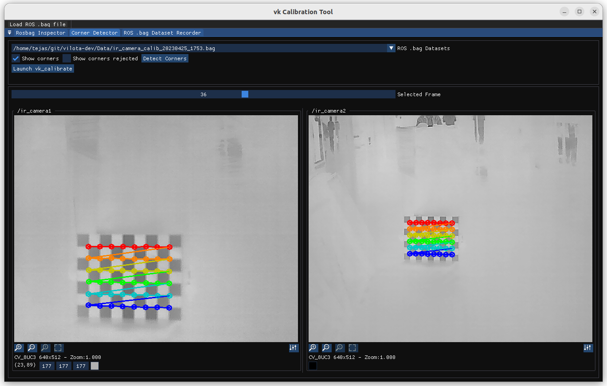
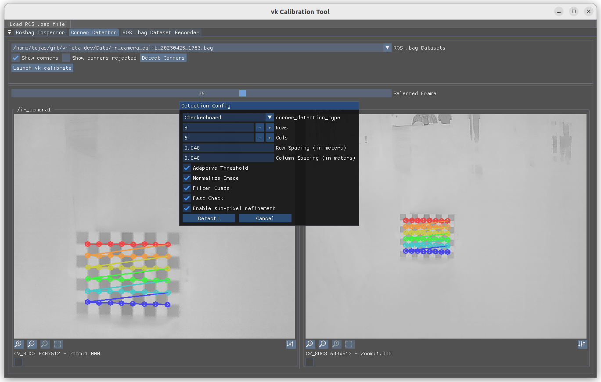
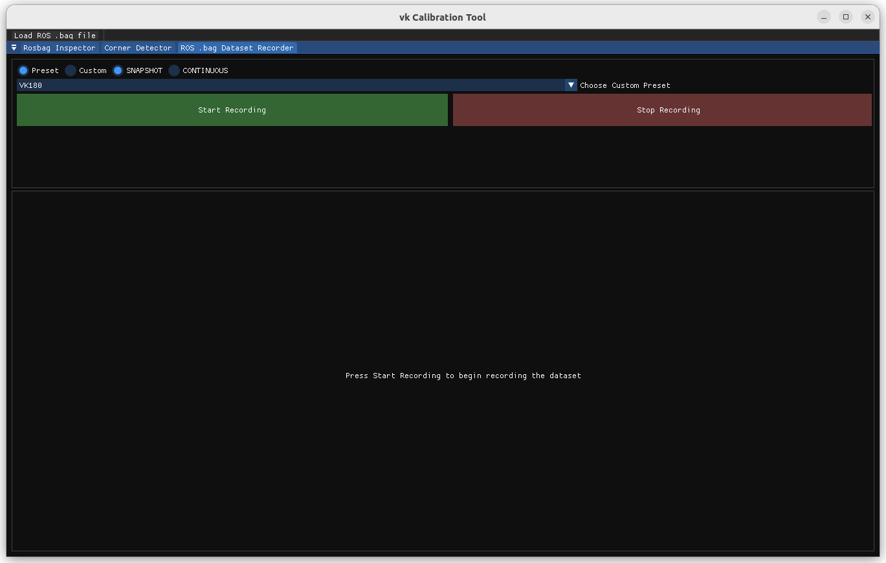
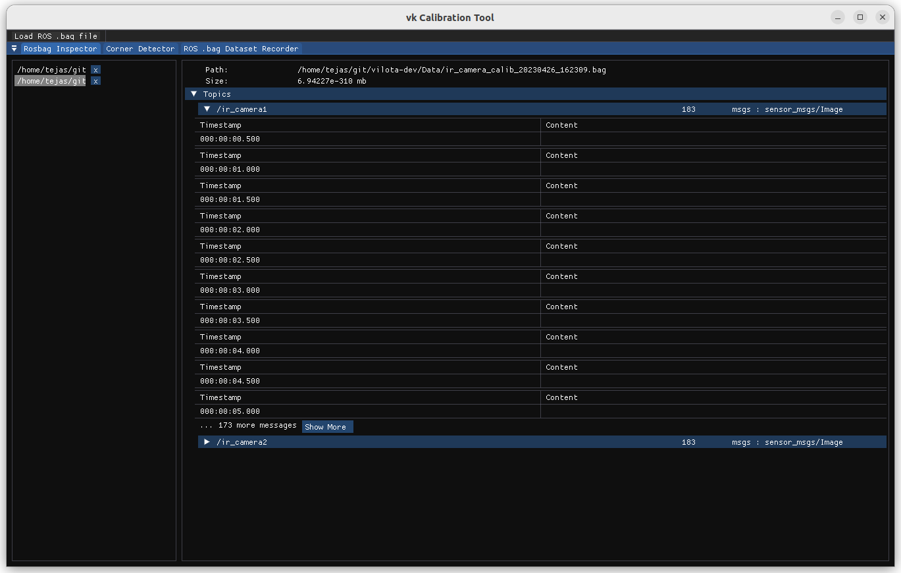

<div align="center">
    
    <h1>vk-calibrate</h1>
    <a href="https://github.com/vilota-dev/calibration_tool/blob/main/LICENSE"></a>
    <a href="https://github.com/vilota-dev/calibration_tool/graphs/contributors"></a>   
    <a href="https://github.com/vilota-dev/calibration_tool/network/members"></a>   
    <a href="https://github.com/vilota-dev/calibration_tool/stargazers"></a>   
    <a href="https://github.com/vilota-dev/calibration_tool/issues"></a>   
    <a href="https://app.circleci.com/pipelines/github/vilota-dev/calibration_tool"></a>   
<br />
    <br />
    <a href="https://app.circleci.com/projects/project-dashboard/github/vilota-dev/">Download</a>
    <span>&nbsp;&nbsp;•&nbsp;&nbsp;</span>
    <a href="https://vilota.ai/#contact">Contact Us</a>
  <br />
  <br />

vk-calibrate is an integrated visualization and calibration tool for robotics, available [as a desktop app](https://app.circleci.com/projects/project-dashboard/github/vilota-dev/) on Linux and macOS.
</div>

# Screenshots

### Corner Detection & ROS `.bag` dataset playback
<p align="center">
  
&nbsp; &nbsp; &nbsp; &nbsp;
  
</p>

### ROS `.bag` dataset recording
<p align="center">
  
</p>

### ROS `.bag` dataset Inspector 
<p align="center">
  
</p>


vk-calibrate is a tool for all things related to calibrating vilota's vk suite of cameras, from recording ROS .bag datasets,
to corner detection (checkerboard, apriltags).

# Features
* Corner detection (checkerboard, apriltags)
  * Integrated with OpenCV's corner detection with sub-pixel refinement
  * Integrated with Basalt's corner detection algorithms and corner refinement
  * Generates serialized binary containing corner detection results and metadata, to feed into [Basalt's calibration pipeline](https://cvg.cit.tum.de/research/vslam/basalt)
  * (REMOVED) Support for libcbdetect corner detection algorithm (poor performance on worse datasets)
  * Automatic serialization into custom cereal binary format
* ROS `.bag` dataset recording functionality
  * Record synchronized ROS `.bag` datasets from multiple cameras (tested up to 6 cameras, VK360)
  * Support for cameras that are not hardware synchronized
  * Support for recording IMU data
  * Supports continuous and snapshot recording modes
  * Has presets for VK180, VK360(front), VK360(back), VK360(full)
* ROS `.bag` dataset inspection
  * Inspect the topics and messages of `.bag` files
  * Supports IMU, Image, PoseStamped, and a few other message types
  * Thread-safe wrapper around ROS's `.bag` API using rigtorp's high performance SPSC queue
* Integration with Basalt's calibration pipeline
  * Launch Basalt's calibration pipeline from within the GUI, and inject the serialized binary generated by vk-calibrate
  * Install calibration priors for Vilota's suite of products

### Developer Notes
* AppState is an instance of a Meyer's threadsafe singleton, access it using AppState::getInstance() to access the global state

### Built With

* C++20
* CMake
* OpenCV
* eCAL 5.12
* ROS
* Basalt
* Boost
* [BS::thread_pool](https://github.com/bshoshany/thread-pool)
* [Rigtorp's SPSC queue](https://rigtorp.se/ringbuffer/)
* Extended Native File Dialog
* spdlog
* tracy (for profiling)
* cereal
* Intel TBB

**GUI Related:**
* imgui
* glad
* glfw 
* OpenGL
* immvision
* implot

## How to run
You can either,
1. Download the binaries directly from CircleCI artifacts, and install them
2. Build from source, following the instructions below
   
## Install prerequisites 

1. Install Cap'n Proto
```sh
git clone https://github.com/capnproto/capnproto.git capnproto
cd capnproto/c++
git checkout v0.10.2
git submodule update --init --recursive
autoreconf -i
./configure
make -j2 # check # skip check for now
sudo make install
```

2. Install eCAL
```sh
sudo add-apt-repository -y ppa:ecal/ecal-5.11
sudo apt-get update
sudo apt-get install ecal
```

3. Install other dependencies
```sh
sudo apt-get update
sudo apt-get install -y cmake libopencv-dev libglfw3-dev libgtk-3-dev libboost-all-dev libeigen3-dev liblz4-dev bzip2
```

## Building from source
```sh
git clone https://github.com/vilota-dev/calibration_tool.git --recursive
cd calibration_tool
cmake -S. -Bbuild
cmake --build build -j2
cd build
cpack
mkdir artifacts
cp *.deb artifacts
cp *.tar.gz artifacts

# Just install the deb package you generated 
sudo dpkg -i calibration_tool-*.deb # replace this with the debian package name
```

<!-- CONTRIBUTING -->
## Contributing

Contributions are what make the open source community such an amazing place to learn, inspire, and create. Any contributions you make are **greatly appreciated**.

If you have a suggestion that would make this better, please fork the repo and create a pull request. You can also simply open an issue with the tag "enhancement".
Don't forget to give the project a star! Thanks again!

1. Fork the Project
2. Create your Feature Branch (`git checkout -b feature/AmazingFeature`)
3. Commit your Changes (`git commit -m 'Add some AmazingFeature'`)
4. Push to the Branch (`git push origin feature/AmazingFeature`)
5. Open a Pull Request

## License

Distributed under the MIT License. See `LICENSE.txt` for more information.


<!-- MARKDOWN LINKS & IMAGES -->
<!-- https://www.markdownguide.org/basic-syntax/#reference-style-links -->
[circleci-url]: 
[circleci-shield]: 